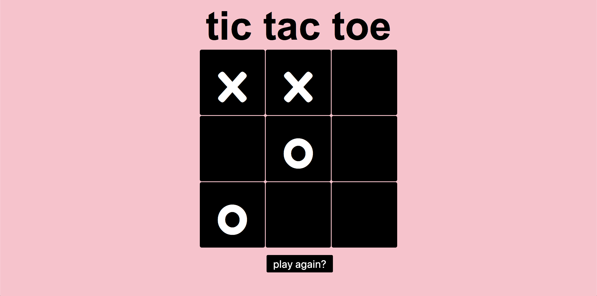

# Tic Tac Toe
#### Project Scope: Design functional inBrowser tic tac toe game. Two players take turns clicking a cell for 'x' and 'o'. When a player wins, an alert displays congratulating the winning letter. 
#### View here: https://sv-dev-tictactoe.netlify.com/

# How it was made:
#### HTML5, CSS3, Javascript E6

# Optimizations
#### The Javascript was written using object oriented programming. 

# Lesson Learned: 
#### I learned how to program the game in an object oriented manner. I declared functions wrapped in objects to reduce complexity. Using OOP also allowed for more efficient use of the properties and methods in separate objects and function declarations.  
